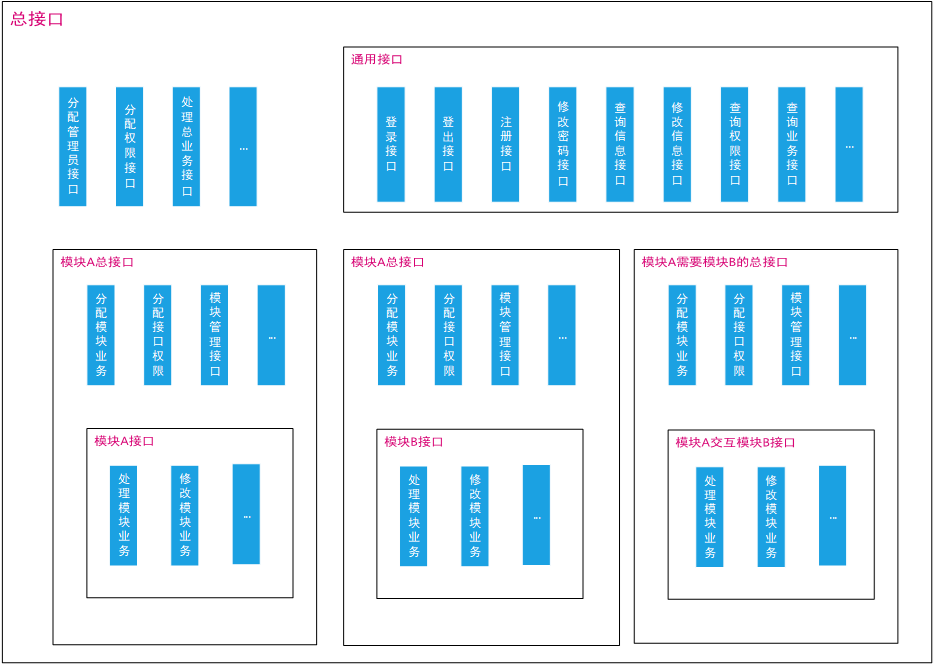
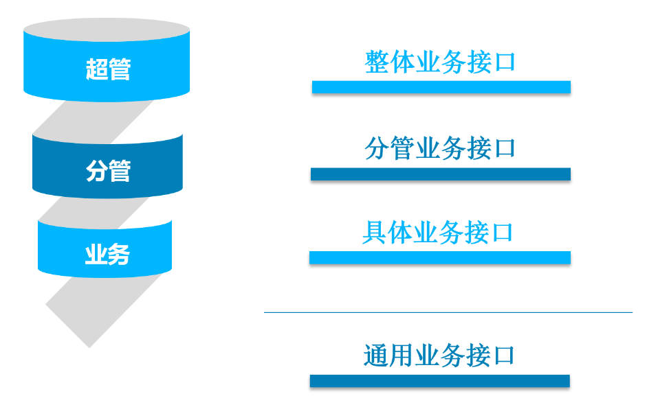

# Web Reducer

[](https://github.com/ymxiong/EamonUtils/blob/master/LICENSE)

Web Reducer 是一个用来简化java web开发的项目，作者熊燚铭、冯昊、王朔。

开源地址：https://github.com/ymxiong/EamonUtils/blob/master/README_zh.md

## 目录

+ [Annotation](#Annotation)
+ [Permission](#Permission)
+ [Security](#Security)
+ [Status](#Status)
+ [Task](#Task)


## [Annotation](id:Annotation)

### 目标

使用 `@Mapper`  `@MapperIgnore`  `@MapperRename`  `@MapperModify`  和 `@MapperExtra`  注解简化实体控制系统，这些注解可配合使用，用于修饰、改造、捆绑实体属性信息、便于提供给前端人员处理，也便于后台配置式管理。

### 安装

添加依赖库至 pom.xml

```xml
<dependency>
    <groupId>cc.eamon.open</groupId>
    <artifactId>annotation</artifactId>
    <version>${annotation-version}</version>
</dependency>
```

### 使用

#### 开始

1. 在实体上添加 `@Mapper` 注解，并为属性添加get、set方法（可配合lombok使用）。

   ```java
   @Mapper
   public class User {
       private int id;
   	...
   }
   ```

2. 编译项目, 系统会自动生成 `UserDefaultMapper` ，包含`Map<> getMap(User obj)`和`User getEntity()`两个主要方法。

   ```java
   public class UserDefaultMapper {
       public int id;
       /**
       * 静态方法，可直接调用
       */
       public static Map<String, Object> getMap(User obj) {
           Map<String, Object> resultMap = new LinkedHashMap<>();
           if (obj == null) return resultMap;
           resultMap.put("id", obj.getId());
           return resultMap;
       }
       /**
       * 需要实例化Mapper后使用
       */
       public User getEntity() {
           User entity = new User();
           entity.setId(this.id);
           return entity;
       }
   }
   ```

3. getMap方法用于将实体转化成Map映射，getEntity方法用于从Mapper中生成实体信息。

4. 此时基本用法已经清晰：

   - Mapper类可作为前端上传使用的json对象，传到后台的信息通过getEntity()生成实体。
   - 后台返回信息时调用getMap()，获得根据配置映射的返回结果。


#### Ignore

场景：前端进行post请求的时候，我们通常不希望前端上传实体id，实体id由后台管理生成并返回给前端。通常的做法是手写Map信息将上传所需要的属性一一对应。在这里使用@MapperIgnore注解可以轻松解决此问题。

1. 为Mapper注解添加post参数，将自动生成 `UserPostMapper`。

2. 在实体中为id字段标注 `@MapperIgnore` 注解， `UserPostMapper` 将自动忽略id字段。

   ```java
   @Mapper("post")
   public class User {
       @MapperIgnore("post")
       private int id;
   	...
   }
   ```

3. 通过`userPostMapper.getEntity()` 获取到的实体信息和通过 `UserPostMapper.getMap(User obj)` 获取到的映射信息都将忽略id属性。


#### Rename

场景1：需要将服务提供给多个业务，业务字段命名不统一，映射起来会十分麻烦。

场景2：需变更对外展示属性名，但业务逻辑上与数据库命名保持一致。

1. 在实体中为需要改名字段标注 `@MapperRename` 注解， 对应的Mapper将自动改名。

   ```java
   @Mapper({"srv1", "srv2"})
   public class User {
   	...
       @MapperRename(value = {"srv1", "srv2"}, name = {"mobile", "tel"})
       private String phone;
   
   }
   ```

2. phone 字段在srv1中将被重命名为mobile，在srv2中将被重命名为tel， 在映射的时候变更属性名，保证在业务流转操作中保持名称一致。


#### Modify

场景1：身份证，手机号等身份信息返回前端时需模糊掉部分信息（如：'10123456789' => '101\*\*\*\*6789' ）。

场景2：保持时间信息一致性，时间以时间戳方式上传。

1. 在实体中添加修改和恢复方法

2. 在实体中为需要改名字段标注 `@MapperModify` 注解

   ```java
   @00Mapper({"srv1", "srv2", ...})
   public class User {
       ...
           
       @MapperRename(value = {"srv1", "srv2"}, name = {"mobile", "tel"})
       @MapperModify(
           value = "srv1", 
           modify = "convertPhone", 
           recover = "")
       private String phone;
   
       @MapperModify(
           value = "srv2", 
           modify = "convertUpdateTime", 
           recover = "setLongUpdateTime")
       private Date updateTime;
   
       public String convertPhone() {
           if (this.phone == null) return "";
           return this.phone.substring(0, 3) + "****" + this.phone.substring(7);
       }
   
       public void setLongUpdateTime(long time){
           this.updateTime = new Date(time);
       }
   
       public Long convertUpdateTime(){
           if (this.updateTime == null) return null;
           return this.updateTime.getTime();
       }
   
   }
   ```

3. phone 字段在srv1中将被格式化，updateTime在srv2中将被修改为Long类型。

#### 小结

通过以上阶段处理，实体配置信息如下：

```java
@Setter
@Getter
@Mapper({"post", "srv1", "srv2"})
public class User {

    @MapperIgnore("post")
    private int id;

    @MapperRename(
        value = {"srv1", "srv2"}, 
        name = {"mobile", "tel"})
    @MapperModify(
        value = "srv1", 
        modify = "convertPhone", 
        recover = "")
    private String phone;

    @MapperModify(
        value = "srv2", 
        modify = "convertUpdateTime", 
        recover = "setLongUpdateTime")
    private Date updateTime;

    public String convertPhone() {
        if (this.phone == null) return "";
        return this.phone.substring(0, 3) + "****" + this.phone.substring(7);
    }

    public void setLongUpdateTime(long time){
        this.updateTime = new Date(time);
    }

    protected Long convertUpdateTime(){
        if (this.updateTime == null) return null;
        return this.updateTime.getTime();
    }

}
```

打印四组Mapper信息如下：

1. DefaultMapper，完整信息

   > {id=1, phone=10123456789, updateTime=Wed Jan 02 15:20:32 CST 2019}

2. PostMapper，忽略id

   > {phone=10123456789, updateTime=Wed Jan 02 15:12:34 CST 2019}

3. Srv1Mapper，phone改名为mobile

   > {id=1, mobile=1016789, updateTime=Wed Jan 02 15:12:34 CST 2019}

4. Srv2Mapper，phone改名为tel，updateTime改类型为Long

   > {id=1, tel=10123456789, updateTime=1546413154309}

即通过配置的方式完成了对实体信息的改进或者增强。


#### 扩展使用：Extra

场景：在更新用户的同时，同时更新用户的权限列表，此时需要给User实体加上权限列表属性

配置如下：

```java
@Setter
@Getter
@Mapper("update")
@MapperExtra(
        value = "update", // 对应的mapper
        list = true, // 是否为list
        name = "permits", // 属性名称
        type = "java.lang.Integer"// 对象类型
)
public class User {

    private int id;

}
```

生成结果：

```java
public class UserUpdateMapper {
    
    public int id;
    
    public List<Integer> permits;
    
    public static Map<String, Object> getMap(User obj) {
        Map<String, Object> resultMap = new LinkedHashMap<>();
        if (obj == null) return resultMap;
        resultMap.put("id", obj.getId());
        return resultMap;
    }
    public static Map<String, Object> getMapWithExtra(User obj, List<Integer> permits) {
        Map<String, Object> resultMap = new LinkedHashMap<>();
        if (obj == null) return resultMap;
        resultMap.put("id", obj.getId());
        resultMap.put("permits", permits);
        return resultMap;
    }
    public User getEntity() {
        User entity = new User();
        entity.setId(this.id);
        return entity;
    }
}
```

系统自动生成getMapWithExtra()方法，参数列表中多出extra字段。

### 开发细节

#### 创建编译时注解

1. @Mapper 只需一个value参数，有多少参数既生成多少张Mapper
2. @MapperIgnore 用于忽略指定属性。只需一个value参数，value参数用于设置作用于哪张mapper。
3. @MapperRename 用于属性改名。需value与name参数，value参数用于设置作用于哪张mapper，name参数用于确定改名后名称信息。
4. @MapperModify 用于属性类型与值的修订。需value、modify与recover参数，value参数用于设置作用于哪张mapper，modify参数用于确定修改参数使用的方法，recover参数用于确定用于恢复修改参数的方法。
5. @MapperExtra 用于给类型增加额外信息。需value、name、type与list参数，value参数用于设置作用于哪张mapper，name参数用于确定额外信息的名称，type信息用于确定额外信息的类型，list信息用于确定额外信息是否为数组。


#### 处理编译时注解

1. 建立 `MapperProcessor` 注解处理器，该处理器只处理有Mapper注解的类，生成与注解配置对应的Mapper。
2. 遇到MapperIgnore字段忽略此字段
3. 遇到MapperRename字段进行改名，同时写出恢复信息。
4. 遇到MapperModify字段进行字段编辑，生成和恢复时调用制定方法。
5. 遇到MapperExtra字段进行数据联合，将其他类引入当前注解处理过程中。
6. 遇到MapperGroup注解时将生成的类加上@Group注解。


#### 写出文件

1. 写出经过 `MapperIgnore` `MapperRename` `MapperModify` 处理后的属性域信息
2. 整合`MapperExtra` 提及的整合信息
3. 域信息写入getMap() 方法
4. 额外域信息写入getMapExtra() 方法
5. 域转换信息写入getEntity() 方法
6. 写出以上方法


## [Permission](id:Permission)

### 目标

Permission模块是自主研发的权限管理框架，用于简化web项目中控制权限的复杂处理逻辑，使用 `@Permission` 和 `@PermissionLimit` 注解简化权限控制系统，目前在多个项目中使用效果极佳，功能进一步完善后将迁移并独立此框架。

### 安装

添加依赖库至 pom.xml

```xml
<dependency>
    <groupId>cc.eamon.open</groupId>
    <artifactId>permission</artifactId>
    <version>${permission-version}</version>
</dependency>
```

### 使用

#### 开始

1. 分析权限控制业务管理模型

   

2. 在控制层添加 `@Permission` 注解,  `@Permission` 注解需要被赋值，这个值用于后续权限控制。

3. 在方法上添加 `@PermissionLimit` 注解,  `@PermissionLimit` 注解可以不被赋值，也可以赋值用以额外控制. 

4. 被打上 `@PermissionLimit`(such as: adminLogin()) 注解的方法会被拦截下来检查权限, 其他方法将正常运作.

   ```java
   @Permission("user")
   @RequestMapping("/user")
   @RestController
   public class UserController {
   
       @RequestMapping(value = "login", method = RequestMethod.GET)
       @ResponseBody
       public Object login(){
           return "Permission Test";
       }
       
       @PermissionLimit
       @RequestMapping(value = "admin/login", method = RequestMethod.GET)
       @ResponseBody
       public Object adminLogin(){
           return "Permission Admin Test";
       }
   
   }
   ```

5. 编译项目, 系统会自动生成 `DefaultChecker.class` 类文件，该类中记录了根据注解配置信息，生成了默认的权限处理方法。

6. 自行定义权限检查器。 推荐直接继承重写 `DefaultChecker`

   ```java
   public class RoleMethodChecker extends DefaultChecker {
   
       @Override
       public boolean checkRole(...) throws StatusException {
           return false;
       }
       
       @Override
       public boolean checkUserAdminLogin(...) throws StatusException {
           return super.checkUserAdminLogin(request, response);
       }
   
       @Override
       ...
       
   }
   ```

##### 与SpringMVC集成

```xml
<bean id="roleMethodChecker" class="?.RoleMethodChecker"/>
<mvc:interceptors>
	<bean class="cc.eamon.open.permission.mvc.PermissionInterceptor" >
		<property name="checker" ref="roleMethodChecker" />
	</bean>
</mvc:interceptors>
```
##### 与SpringBoot集成

```java
@Configuration
public class RoleMethodConfig extends WebMvcConfigurerAdapter {

    @Bean
    public RoleMethodChecker roleMethodChecker(){
        return new RoleMethodChecker();
    }

    @Override
    public void addInterceptors(InterceptorRegistry registry) {
        registry.addInterceptor(new PermissionInterceptor(roleMethodChecker()))
            .addPathPatterns("/**");
        super.addInterceptors(registry);
    }
}
```

>  下面是见证奇迹的时刻

#### Api管理

1. 重写 DefaultChecker 中的检查方法。

2. 通过返回语句决定是否拦截。

   ***通过示例***

   ```java
   @Override public boolean checkUserAdminLogin(...){return true;}
   ```

   ***结果***

   >  localhost:8080/user/admin/login -> Permission Admin Test

   ***拦截示例***

   ```java
   @Override public boolean checkUserAdminLogin(...){return false;}
   ```

   ***结果***

   >  localhost:8080/user/admin/login -> {"result":false ...}

3. 你可以通过 `PermissionValue.class`获取到自动生成的方法描述信息，或者通过你自己的方式管理方法描述信息。

4. 使用你自己的存储系统管理你的方法权限信息，可以选择关系型数据库、内存数据库，或者单纯保存在内存中。

   ***简单的使用例子***

   ```java
   @Autowired
   private UserService userService;
   
   @Override
   public boolean checkUserAdminLogin(...) ... {
       Map<String, String[]> reqMap = request.getParameterMap();
       String account = reqMap.get("account")[0];
       User user = userService.findOneByAccount(account);
       for (String method:user.getMethods()){
           if (method.equals(PermissionValue.USER_ADMINLOGIN))return true;
       }
       return false;
   }
   ```


#### 角色管理

1. 分析角色权限业务管理模型

   

2. 添加 `permission.properties` 文件至 classpath. 

   ```properties
   #Super Admin Accessible Interface
   SUPER_PRIVATE	=	SUPER
   #Admin Accessible Interface
   ADMIN_PRIVATE	=	SUPER,ADMIN
   #User Personal Accessible Interface
   USER_PRIVATE	=	SUPER,ADMIN,USER
   #User Accessible Interface After Login
   USER_PUBLIC		=	SUPER,ADMIN,USER
   ```

3. 使用你自己的存储系统管理你的角色信息, 可以选择关系型数据库、内存数据库，或者单纯保存在内存中。

   ***示例***

   | id    |   password   | role  |
   | ----- | :----------: | :---: |
   | 10001 | \*\*\*\*\*\* | SUPER |
   | 10002 | *\*\*\*\*\*  | ADMIN |

4. 编译项目. `PermissionRole.class` 会自动生成.

   ```java
   public class PermissionRole {
     public static final String ADMIN_PRIVATE = "admin_private";
   
     public static final String USER_PRIVATE = "user_private";
   
     public static final String USER_PUBLIC = "user_public";
   
     public static final String SUPER_PRIVATE = "super_private";
   }
   ```


#### 扩展

1. 实现一个你自己的检查器

```java
public class YourOwnChecker implements PermissionChecker {

    @Override
    public boolean preHandle(...) throws Exception {
        return true;
    }

    @Override
    public void postHandle(...) throws Exception {}

    @Override
    public void afterCompletion(...) throws Exception {}

    @Override
    public boolean check(...) throws StatusException {
        return true;
    }

}
```


## [Security](id:Security)

### 目标

简化Web加解密操作，目前涵盖四种算法，仍在持续更新中。

编解码算法：

+ Base64
+ MD5

加解密算法：

+ RSA
+ AES

### 安装

添加依赖库至 pom.xml

```xml
<dependency>
    <groupId>cc.eamon.open</groupId>
    <artifactId>security</artifactId>
    <version>${security-version}</version>
</dependency>
```

### 使用

编解码：

```java
String encode = SecurityFactory
	.getCodeMethod(CodeMethod.SUPPORT.CODE_BASE64)
    .encode("eamon".getBytes("utf8"));
byte[] decode =SecurityFactory
	.getCodeMethod(CodeMethod.SUPPORT.CODE_BASE64)
    .decode(encode);
System.out.println(encode);
System.out.println(new String(decode, "utf8"));
```

结果：

> ZWFtb24=
> eamon


加解密：

```java
byte[] encrypt = SecurityFactory
	.getCipherMethod(CipherMethod.SUPPORT.CIPHER_RSA)
    .encrypt("eamon".getBytes("utf8"), RSA.RSAPublicKey);
byte[] decrypt =SecurityFactory
	.getCipherMethod(CipherMethod.SUPPORT.CIPHER_RSA)
    .decrypt(encrypt, RSA.RSAPrivateKey);
System.out.println(new String(decrypt, "utf8"));
```

结果：

> eamon

### 配合使用

加密并编码：

```java
byte[] encryptString = SecurityFactory
	.getCodeMethod(CodeMethod.SUPPORT.CODE_BASE64)
    .encode(
    	SecurityFactory
    		.getCipherMethod(CipherMethod.SUPPORT.CIPHER_RSA)
    		.encrypt("eamon".getBytes("utf8"), RSA.RSAPublicKey)
	);
```

解码并解密：

```java
String decryptString = SecurityFactory
	.getCipherMethod(CipherMethod.SUPPORT.CIPHER_RSA)
    .decrypt(
		SecurityFactory
        	.getCodeMethod(CodeMethod.SUPPORT.CODE_BASE64)
    		.decode(encryptString),
    	RSA.RSAPrivateKey
	);
```


## [Status](id:Status)

### 目标

简化状态码和错误管理，状态码通过配置管理，错误通过抛出的方式交付错误状态管理模块，返回统一的数据结构至前端。

### 安装

添加依赖库至 pom.xml

```xml
<dependency>
    <groupId>cc.eamon.open</groupId>
    <artifactId>status</artifactId>
    <version>${status-version}</version>
</dependency>
```

### 使用

1. Controller对象继承 `StatusBaseController` , 经过这样处理后controller层的所有错误抛出将会被统一处理，返回给前段可控的结果。

   ```java
   @RestController
   @RequestMapping("user")
   public class UserController extends StatusBaseController {
       ...
   }
   ```

2. 配置 `status.properties` 文件，将状态码以配置的形式写入文件。

   ```properties
   SUCCESS       =  200,请求成功
   DATABASE_ERROR  =   500,数据库错误
   FAILED       =  700,请求失败
   NOT_RECOGNIZED       =  1000,未识别
   
   TOO_FREQUENT   =  701,请求过于频繁
   INVALID          =  702,请求失效
   ERROR_DATA    =  703,参数错误
   USER_NULL     =  704,用户名错误（用户不存在）
   USER_EXIST    =  705,用户名已注册
   CAPTCHA_N_VAILD    =  706,验证码过期
   CAPTCHA_ERROR  =  707,验证码错误
   PASSWORD_ERROR =  708,密码错误
   UNLOGIN    =  709,未登录
   PASSWORD_FORMAT_ERROR  =  710,密码格式错误
   FILEUPLOAD_ERROR      =  711,文件上传失败
   FILE_TOO_LARGE       =  712,文件过大
   UNSUPPORT_IMAGE_FORMAT =  713,不支持的图片格式
   UNSUPPORT_FILE_FORMAT  =  714,不支持的文件格式
   WRONG_EMAIL             =  718,邮箱错误
   EMAIL_EXIST             =  719,邮箱已存在
   WRONG_EMAIL_FORMAT    =  720,邮箱格式错误
   WRONG_PHONE_FORMAT    =  721,电话格式错误
   ```

3. 在成功处理错误信息的接口返回`Status`

   ```java
   @Transactional(rollbackFor = Exception.class)
   @RequestMapping(value = "login", method = RequestMethod.GET)
   @ResponseBody
   public Status login(...) throws Exception {
       return new Status(
               true,
               StatusCode.getCode("SUCCESS"),
               userService.login(...),
               "Login Success"
       );
   }
   ```

4. 结果如下：

   ```json
   {
       result: true, 
       statusCode: 200,
       data: true, 
       extra: "登录成功", 
   }
   ```

5. 在需要报错的位置处理错误

   ```java
   public User getUserById(int userId) throws StatusException{
       User user = userDao.selectByPrimaryKey(userId);
       if(user == null) throw new StatusException("USER_NULL");
       return user;
   }
   ```

6. 结果如下：

   ```json
   {
       result: false, 
       statusCode: 704,
       data: false, 
       extra: "用户名错误（用户不存在）", 
   }
   ```

由此，错误控制从复杂的逻辑语句与返回构造语句简化为继承和抛出两个主要操作，状态信息均通过配置管理，配置与代码结构，状态控制彻底简化。


## [Task](id:Task)

### 目标

Task模块为自主研发的进程流转框架，用于简化web项目中任务流转的复杂处理逻辑。框架将实际任务流转过程抽象为树状图，树的子节点以此相连，分层治理，数据存储从框架中解耦，交给用户自行选择合适的存储方式，在项目开发前和项目开发中可随时切入，解决Activiti框架与数据存储层过分耦合的问题。功能进一步完善后将独立。

### 安装

添加依赖库至 pom.xml

```xml
<dependency>
    <groupId>cc.eamon.open</groupId>
    <artifactId>task</artifactId>
    <version>${task-version}</version>
</dependency>
```

### 使用

1. 实现Context，Context 保存任务基本上下文信息，通常由任务实体承担，任务实体实现Context即可完成任务上下文流转的功能。

   ```java
   public interface Context{
       Integer getId(); // 上下文流转id
       Integer getRootId(); // 上下文流转根id
       Integer getPreId(); // 上文id
       Integer getNextId(); // 下文id
       String getName(); // 任务名
       String getExtra(); // 冗余信息
       String getStateName(); // 状态名
       void setId(Integer id);
       void setRootId(Integer id);
       void setPreId(Integer id);
       void setNextId(Integer id);
       void setName(String name);
       void setStateName(String name);
   }
   ```

2. 实现DataSource，`DataSource`处理数据源基本操作。数据的处理直接交由业务层进行，业务层如何实现交由用户自行选择合适的方案，以下为数据源处理示例。

   ```java
   @Service
   public class TaskService implements DataSource{
   	...
       
       @Override
       public int insert(Context t) {
           if (t == null) return 0;
           return taskDao.insertSelective(t);
       }
   
       @Override
       public int update(Context t) {
           return taskDao.updateByPrimaryKeySelective(t);
       }
   
       @Override
       public Context load(Integer id) {
           return taskDao.selectByPrimaryKey(id);
       }
   
       @Override
       public List<? extends Context> loadAll(int id) {
           return taskDao.selectSubTaskListById(id);
       }
   ```

3. 处理好上下文和数据源后，接下来便可以对任务流转情况进行设计，定义任务流转图，制定任务流转规则，编写流转细节处理代码。

   ```java
   public class MainTask extends MainTaskHolder {
   
       public MainTask(Context context) {
           super(context);
           context.setName("main");
       }
   
       @Override
       public void initStateMap(Map<String, State> stateMap) {
           stateMap.put("a", new AState());
           stateMap.put("b", new BState());
           stateMap.put("c", new CState());
       }
   
       public SubTaskHolder create(){
           setState(getStateMap().get("a"));
           getContext().setStateName(getState().getName());
           Context context = new ...();
           SubTaskHolder subTask = new ATask(context);
           return subTask.create();
       }
   }
   ```

   ```java
   public class ATask extends SubTaskHolder {
   
       public ATask(Context context) {
           super(context);
           getContext().setName("a");
       }
   
       @Override
       public void initStateMap(Map<String, State> stateMap) {
           stateMap.put("open", new AOpenState());
           stateMap.put("close", new ACloseState());
           stateMap.put("finish", new AFinishState());
       }
   
       @Override
       public SubTaskHolder create() {
           setState(getStateMap().get("open"));
           getContext().setStateName(getState().getName());
           return this;
       }
   }
   ```

4. 编写状态流转，下层状态变化将实现全过程任务流转。

   ```java
   public class AState implements State {
   
       @OverridA
       public String getName() {
           return "a";
       }
   
       @Override
       public void setName(String name) {}
   
       @Override
       public Object execute(Context context, Object... args) {
           MainTask mainTask = (MainTask) args[0];
           return mainTask.getLastTask().execute(mainTask.getLastTask(), taskManager);
       }
   }
   ```

5. 编写状态流转，上层树状态变化将引起下层树状态变化。

   ```java
   public class AOpenState implements State {
       
       @Override
       public String getName() {
           return "open";
       }
   
       @Override
       public void setName(String name) {}
   
       @Override
       public Object execute(Context context, Object... args) {
           TaskManager taskManager = (TaskManager) args[1];
   		// 新建上下文
           Context mContext = new ...();
           mContext.setRootId(context.getRootId());
           mContext.setPreId(context.getId());
           // 子任务Holder
           SubTaskHolder subTask = new ATask(mContext);
           taskManager.insert(subTask.getContext());
           context.setNextId(mContext.getId());
           // task更新
           taskManager.update(context);
           return subTask;
       }
   }
   ```

6. 以上过程既实现了任务全文流转，且将过程流转与业务逻辑解耦，数据存储与任务框架解耦。


## License

```
Copyright 2018 eamon

Licensed under the Apache License, Version 2.0 (the "License");
you may not use this file except in compliance with the License.
You may obtain a copy of the License at

   http://www.apache.org/licenses/LICENSE-2.0

Unless required by applicable law or agreed to in writing, software
distributed under the License is distributed on an "AS IS" BASIS,
WITHOUT WARRANTIES OR CONDITIONS OF ANY KIND, either express or implied.
See the License for the specific language governing permissions and
limitations under the License.
```